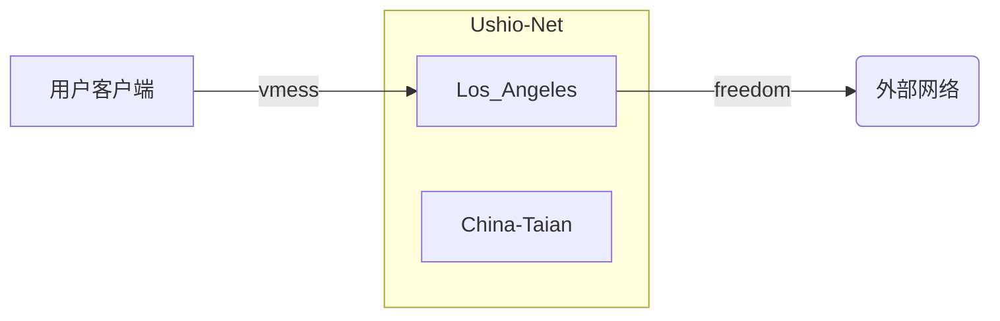
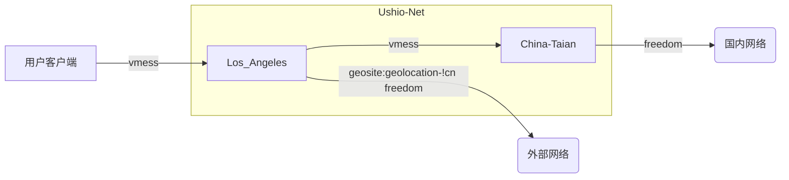

# 综述

Ushio-Net网络基于[V2Ray](https://www.v2ray.com/)，是通过在两台服务器（Los_Angeles, China-Taian）以及客户终端上部署V2Ray组件实现的跨区域私密隧道网络。


?> 您可以通过[这个网站](https://monitor.yimian.xyz)查看服务器集群的实时状态。


# v-usa线路

## 架构设计



如上图所示，v-usa线路中，国内用户通过客户端将数据加密，使用vmess协议发送至Los\_Angeles服务器，Los\_Angeles服务器解密后将其以先前协议重新发往外部网络。

## V2Ray配置

```js
{
    "inbounds": [
        {
            "port": 10808,
            "protocol": "vmess",
            "settings": {
                "clients": []
            },
            "streamSettings": {
                "network": "ws"
            },
            "sniffing": {
                "enabled": true,
                "destOverride": [
                    "http",
                    "tls"
                ]
            }
        }
    ],
    "outbounds": [
        {
            "protocol": "freedom",
            "settings": {
                "domainStrategy": "UseIP"
            },
            "tag": "direct"
        },
        {
            "protocol": "blackhole",
            "settings": {},
            "tag": "blocked"
        },
        {
            "protocol": "mtproto",
            "settings": {},
            "tag": "tg-out"
        }
    ],
    "routing": {
        "domainStrategy": "IPOnDemand",
        "rules": [
            {
                "type": "field",
                "ip": [
                    "0.0.0.0/8",
                    "10.0.0.0/8",
                    "100.64.0.0/10",
                    "127.0.0.0/8",
                    "169.254.0.0/16",
                    "172.16.0.0/12",
                    "192.0.0.0/24",
                    "192.0.2.0/24",
                    "192.168.0.0/16",
                    "198.18.0.0/15",
                    "198.51.100.0/24",
                    "203.0.113.0/24",
                    "::1/128",
                    "fc00::/7",
                    "fe80::/10"
                ],
                "outboundTag": "blocked"
            },
            {
                "type": "field",
                "inboundTag": [
                    "tg-in"
                ],
                "outboundTag": "tg-out"
            },
            {
                "type": "field",
                "domain": [
                    "domain:epochtimes.com",
                    "domain:epochtimes.com.tw",
                    "domain:epochtimes.fr",
                    "domain:epochtimes.de",
                    "domain:epochtimes.jp",
                    "domain:epochtimes.ru",
                    "domain:epochtimes.co.il",
                    "domain:epochtimes.co.kr",
                    "domain:epochtimes-romania.com",
                    "domain:erabaru.net",
                    "domain:lagranepoca.com",
                    "domain:theepochtimes.com",
                    "domain:ntdtv.com",
                    "domain:ntd.tv",
                    "domain:ntdtv-dc.com",
                    "domain:ntdtv.com.tw",
                    "domain:minghui.org",
                    "domain:renminbao.com",
                    "domain:dafahao.com",
                    "domain:dongtaiwang.com",
                    "domain:falundafa.org",
                    "domain:wujieliulan.com",
                    "domain:ninecommentaries.com",
                    "domain:shenyun.com"
                ],
                "outboundTag": "blocked"
            },
            {
                "type": "field",
                "protocol": [
                    "bittorrent"
                ],
                "outboundTag": "blocked"
            }
        ]
    }
}
```

如上文所示，用户数据以vmess-ws形式进入服务器，然后服务器将以freedom形式将与外界建立连接。在路由过程中，我们对对局域网地址的请求，部分垃圾网站请求，以及种子进行了屏蔽丢包。


# v-china线路

## 架构设计



如上图所示，v-china线路中，国外用户通过客户端将数据加密，使用vmess协议发送至Los\_Angeles服务器，Los\_Angeles服务器通过反向代理将流量转发至国内China-Taian这一个没有公网IP的服务器，China-Taian将流量解密后将其以先前协议重新发往外部网络。

## V2Ray配置

### Los_Angeles

```js
  
{
    "reverse": {
        "portals": [
            {
                "tag": "portal",
                "domain": "usa-china.tunnel.yimian.xyz"
            }
        ]
    },
    "inbounds": [
        {
            "tag": "external",
            "port": 80,
            "protocol": "vmess",
            "settings": {
                "clients": []
            },
            "streamSettings": {
                "network": "ws"
            },
            "sniffing": {
                "enabled": true,
                "destOverride": [
                    "http",
                    "tls"
                ]
            }
        },
        {
            "tag": "tunnel",
            "port": 81,
            "protocol": "vmess",
            "settings": {
                "clients": []
            },
            "streamSettings": {
                "network": "ws",
                "path": "/"
            }
        }
    ],
    "outbounds": [
        {
            "protocol": "freedom",
            "settings": {
                "domainStrategy": "UseIP"
            },
            "tag": "direct"
        }
    ],
    "routing": {
        "rules": [
            {
                "type": "field",
                "inboundTag": [
                    "external"
                ],
                "domain": [
                    "geosite:geolocation-!cn"
                ],
                "outboundTag": "freedom"
            },
            {
                "type": "field",
                "inboundTag": [
                    "external"
                ],
                "outboundTag": "portal"
            },
            {
                "type": "field",
                "inboundTag": [
                    "tunnel"
                ],
                "domain": [
                    "full:usa-china.tunnel.yimian.xyz"
                ],
                "outboundTag": "portal"
            }
        ]
    }
}
```

如上文所示，用户数据以vmess-ws形式进入服务器，然后服务器将其以反向代理方式传入两个服务器之间的vmess通道。在路由过程中，如果发现请求目标是国外的常见网站，比如google, youtube, 则不再发往China-Taian而是直接与网站服务器以freedom建立联系。


### China-Taian

```js
{
    "reverse": {
        "bridges": [
            {
                "tag": "bridge",
                "domain": "usa-china.tunnel.yimian.xyz"
            }
        ]
    },
    "outbounds": [
        {
            "tag": "tunnel",
            "protocol": "vmess",
            "settings": {
                "vnext": [
                    {
                        "address": "v-china-tunnel.yimian.xyz",
                        "port": 443,
                        "users": []
                    }
                ]
            },
            "streamSettings": {
                "network": "ws",
                "security": "tls",
                "tlsSettings": {
                    "serverName": "v-china-tunnel.yimian.xyz"
                },
                "wsSettings": {
                    "connectionReuse": true,
                    "path": "/",
                    "headers": {
                        "Host": "v-china-tunnel.yimian.xyz"
                    }
                }
            }
        },
        {
            "protocol": "freedom",
            "settings": {
            },
            "tag": "out"
        },
        {
            "protocol": "blackhole",
            "settings": {},
            "tag": "blocked"
        }
    ],
    "dns": {
        "servers": [
            "localhost"
        ]
    },
    "routing": {
        "domainStrategy": "IPOnDemand",
        "rules": [
            {
                "type": "field",
                "ip": [
                    "0.0.0.0/8",
                    "10.0.0.0/8",
                    "100.64.0.0/10",
                    "127.0.0.0/8",
                    "169.254.0.0/16",
                    "172.16.0.0/12",
                    "192.0.0.0/24",
                    "192.0.2.0/24",
                    "192.168.0.0/16",
                    "198.18.0.0/15",
                    "198.51.100.0/24",
                    "203.0.113.0/24",
                    "::1/128",
                    "fc00::/7",
                    "fe80::/10"
                ],
                "outboundTag": "blocked"
            },
            {
                "type": "field",
                "inboundTag": ["bridge"],
                "domain": ["full:usa-china.tunnel.yimian.xyz"],
                "outboundTag": "tunnel"
            },
            {
                "type": "field",
                "inboundTag": ["bridge"],
                "outboundTag": "out"
            }
        ]
    }
}
```

China-Taian服务器将两服务器间隧道传来的流量解密，并以freedom形式将与外界建立连接。在路由过程中，我们对对局域网地址的请求，部分垃圾网站请求，以及种子进行了屏蔽丢包。


----------------

[<kbd>&rarr;</kbd> 下一页](/changelog)