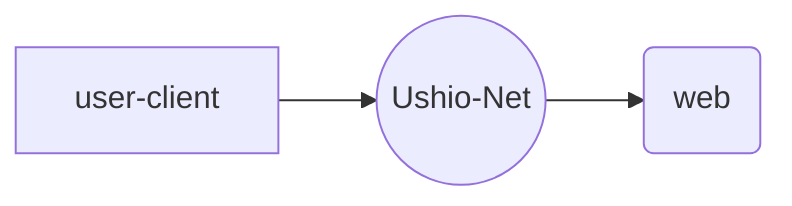

# Ushio-Net

> Link the entire world!

# Fundamental

Ushio-Net is a global high-speed private agent network, dedicated to helping users access to agents around the world.

Currently, Ushio-Net has supported the following two services.

## Access to external networks from mainland China

Users in China use a dedicated software client (V2Ray client) to connect devices (mobile phones, computers, tablets, routers) to Ushio-Net, thereby achieving access to the Internet outside the `GFW firewall`.

This method can help domestic users to access the following services including but not limited to:
 -All Google services
 -YouTube
 -WiKipedia
 -Facebook
 -HSBC APP
 -Twitter
 -Telegram
 -Github speed up
 -npm speed up
 -Instagram
 -WhatsApp
 -Spotify

In addition, users can manually configure the client to achieve acceleration of more foreign websites and anonymous access to specific websites (not revealing your real IP).

## Visit the mainland network from abroad

Users abroad use a dedicated software client (V2Ray client) to connect devices (mobile phones, computers, tablets, routers) to Ushio-Net, so as to achieve proxy access to the Chinese Internet.

This method can help foreign users break the copyright restrictions of many domestic websites and use their services as if they were in China. These domestic services include but are not limited to the following:
 -NetEase Cloud Music
 -Tencent Video
 -Bilibili
 -Iqiyi video
 -QQ Music
 - NetEase mailbox
 -Youku Video

In addition, users can manually configure the client to achieve acceleration of more domestic websites and anonymous access to specific websites (not revealing your real IP).

----------------

[<kbd>&rarr;</kbd> Next](/en/usage)