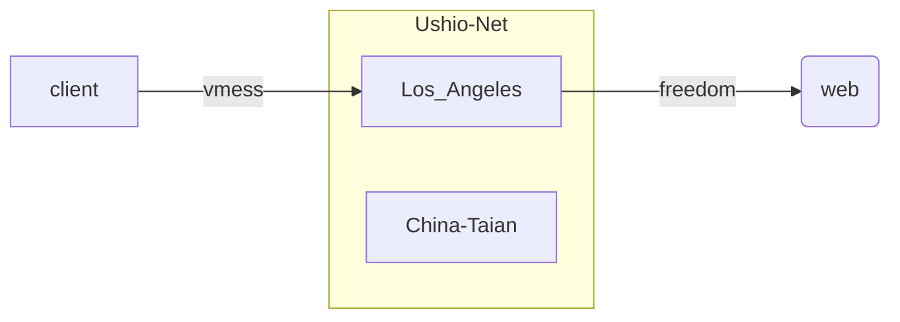
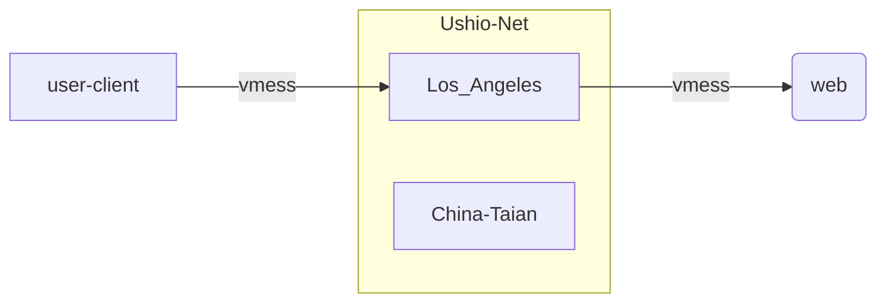

# Summary

Ushio-Net network is based on [V2Ray](https://www.v2ray.com/), which is a cross-regional private tunnel network implemented by deploying V2Ray components on two servers (Los_Angeles, China-Taian) and client terminals.


?> You can check the real-time status of the server cluster through [this website](https://monitor.yimian.xyz).


# v-usa line

## Architecture Design



As shown in the figure above, in the v-usa line, domestic users encrypt data through the client and send it to the Los\_Angeles server using the vmess protocol. The Los\_Angeles server decrypts it and resends it to the external network using the previous protocol.

## V2Ray configuration

```js
{
    "inbounds": [
        {
            "port": 10808,
            "protocol": "vmess",
            "settings": {
                "clients": []
            },
            "streamSettings": {
                "network": "ws"
            },
            "sniffing": {
                "enabled": true,
                "destOverride": [
                    "http",
                    "tls"
                ]
            }
        }
    ],
    "outbounds": [
        {
            "protocol": "freedom",
            "settings": {
                "domainStrategy": "UseIP"
            },
            "tag": "direct"
        },
        {
            "protocol": "blackhole",
            "settings": {},
            "tag": "blocked"
        },
        {
            "protocol": "mtproto",
            "settings": {},
            "tag": "tg-out"
        }
    ],
    "routing": {
        "domainStrategy": "IPOnDemand",
        "rules": [
            {
                "type": "field",
                "ip": [
                    "0.0.0.0/8",
                    "10.0.0.0/8",
                    "100.64.0.0/10",
                    "127.0.0.0/8",
                    "169.254.0.0/16",
                    "172.16.0.0/12",
                    "192.0.0.0/24",
                    "192.0.2.0/24",
                    "192.168.0.0/16",
                    "198.18.0.0/15",
                    "198.51.100.0/24",
                    "203.0.113.0/24",
                    "::1/128",
                    "fc00::/7",
                    "fe80::/10"
                ],
                "outboundTag": "blocked"
            },
            {
                "type": "field",
                "inboundTag": [
                    "tg-in"
                ],
                "outboundTag": "tg-out"
            },
            {
                "type": "field",
                "domain": [
                    "domain:epochtimes.com",
                    "domain:epochtimes.com.tw",
                    "domain:epochtimes.fr",
                    "domain:epochtimes.de",
                    "domain:epochtimes.jp",
                    "domain:epochtimes.ru",
                    "domain:epochtimes.co.il",
                    "domain:epochtimes.co.kr",
                    "domain:epochtimes-romania.com",
                    "domain:erabaru.net",
                    "domain:lagranepoca.com",
                    "domain:theepochtimes.com",
                    "domain:ntdtv.com",
                    "domain:ntd.tv",
                    "domain:ntdtv-dc.com",
                    "domain:ntdtv.com.tw",
                    "domain:minghui.org",
                    "domain:renminbao.com",
                    "domain:dafahao.com",
                    "domain:dongtaiwang.com",
                    "domain:falundafa.org",
                    "domain:wujieliulan.com",
                    "domain:ninecommentaries.com",
                    "domain:shenyun.com"
                ],
                "outboundTag": "blocked"
            },
            {
                "type": "field",
                "protocol": [
                    "bittorrent"
                ],
                "outboundTag": "blocked"
            }
        ]
    }
}
```

As shown above, user data enters the server in the form of vmess-ws, and then the server will establish a connection with the outside world in the form of freedom. During the routing process, we shielded and dropped packets from requests for LAN addresses, some spam website requests, and seeds.


# v-china line

## Architecture Design



As shown in the figure above, in the v-china line, foreign users encrypt data through the client and send it to the Los\_Angeles server using the vmess protocol. The Los\_Angeles server forwards the traffic to the domestic China-Taian through a reverse proxy. Network IP server, China-Taian decrypts the traffic and resends it to the external network using the previous protocol.

## V2Ray configuration

### Los_Angeles

```js
  
{
    "reverse": {
        "portals": [
            {
                "tag": "portal",
                "domain": "usa-china.tunnel.yimian.xyz"
            }
        ]
    },
    "inbounds": [
        {
            "tag": "external",
            "port": 80,
            "protocol": "vmess",
            "settings": {
                "clients": []
            },
            "streamSettings": {
                "network": "ws"
            },
            "sniffing": {
                "enabled": true,
                "destOverride": [
                    "http",
                    "tls"
                ]
            }
        },
        {
            "tag": "tunnel",
            "port": 81,
            "protocol": "vmess",
            "settings": {
                "clients": []
            },
            "streamSettings": {
                "network": "ws",
                "path": "/"
            }
        }
    ],
    "outbounds": [
        {
            "protocol": "freedom",
            "settings": {
                "domainStrategy": "UseIP"
            },
            "tag": "direct"
        }
    ],
    "routing": {
        "rules": [
            {
                "type": "field",
                "inboundTag": [
                    "external"
                ],
                "domain": [
                    "geosite:geolocation-!cn"
                ],
                "outboundTag": "freedom"
            },
            {
                "type": "field",
                "inboundTag": [
                    "external"
                ],
                "outboundTag": "portal"
            },
            {
                "type": "field",
                "inboundTag": [
                    "tunnel"
                ],
                "domain": [
                    "full:usa-china.tunnel.yimian.xyz"
                ],
                "outboundTag": "portal"
            }
        ]
    }
}
```

As shown above, user data enters the server in the form of vmess-ws, and then the server transfers it to the vmess channel between the two servers in a reverse proxy mode. During the routing process, if the request target is found to be a common foreign website, such as google, youtube, it will no longer be sent to China-Taian but will directly establish contact with the website server through freedom.


### China-Taian

```js
{
    "reverse": {
        "bridges": [
            {
                "tag": "bridge",
                "domain": "usa-china.tunnel.yimian.xyz"
            }
        ]
    },
    "outbounds": [
        {
            "tag": "tunnel",
            "protocol": "vmess",
            "settings": {
                "vnext": [
                    {
                        "address": "v-china-tunnel.yimian.xyz",
                        "port": 443,
                        "users": []
                    }
                ]
            },
            "streamSettings": {
                "network": "ws",
                "security": "tls",
                "tlsSettings": {
                    "serverName": "v-china-tunnel.yimian.xyz"
                },
                "wsSettings": {
                    "connectionReuse": true,
                    "path": "/",
                    "headers": {
                        "Host": "v-china-tunnel.yimian.xyz"
                    }
                }
            }
        },
        {
            "protocol": "freedom",
            "settings": {
            },
            "tag": "out"
        },
        {
            "protocol": "blackhole",
            "settings": {},
            "tag": "blocked"
        }
    ],
    "dns": {
        "servers": [
            "localhost"
        ]
    },
    "routing": {
        "domainStrategy": "IPOnDemand",
        "rules": [
            {
                "type": "field",
                "ip": [
                    "0.0.0.0/8",
                    "10.0.0.0/8",
                    "100.64.0.0/10",
                    "127.0.0.0/8",
                    "169.254.0.0/16",
                    "172.16.0.0/12",
                    "192.0.0.0/24",
                    "192.0.2.0/24",
                    "192.168.0.0/16",
                    "198.18.0.0/15",
                    "198.51.100.0/24",
                    "203.0.113.0/24",
                    "::1/128",
                    "fc00::/7",
                    "fe80::/10"
                ],
                "outboundTag": "blocked"
            },
            {
                "type": "field",
                "inboundTag": ["bridge"],
                "domain": ["full:usa-china.tunnel.yimian.xyz"],
                "outboundTag": "tunnel"
            },
            {
                "type": "field",
                "inboundTag": ["bridge"],
                "outboundTag": "out"
            }
        ]
    }
}
```

The China-Taian server decrypts the traffic from the tunnel between the two servers and establishes a connection with the outside world in the form of freedom. During the routing process, we shielded and dropped packets from requests for LAN addresses, some spam website requests, and seeds.


----------------

[<kbd>&rarr;</kbd> Next](/en/changelog)