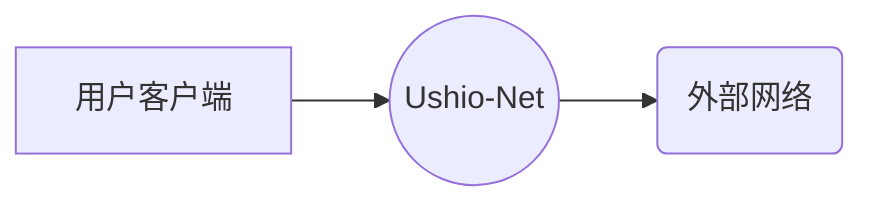
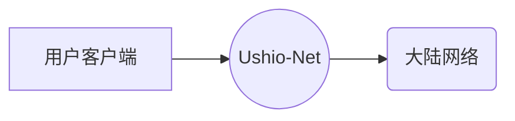

# Ushio-Net

> Link the entire world!

# 基本原理

Ushio-Net是一个全球范围的高速私人代理网络，致力于帮助用户对全球各地网络的代理访问。

目前，Ushio-Net已支持以下两种服务。

## 从中国大陆访问外部网络

用户在国内使用专用软件客户端（V2Ray客户端）将设备（手机，电脑，平板，路由器）接入到Ushio-Net，从而实现对`GFW防火墙`外互联网的访问。

此方法能够帮助国内用户对包括但不局限于以下服务进行访问：
 - 所有Google服务
 - YouTube
 - WiKipedia
 - Facebook
 - HSBC APP
 - Twitter
 - Telegram
 - Github提速
 - npm提速
 - Instagram
 - WhatsApp
 - Spotify

此外，用户可以手动配置客户端，实现对更多国外网站的加速，以及对特定网站的匿名访问（不会暴露你的真实IP）。

## 从国外访问大陆网络

用户在国外使用专用软件客户端（V2Ray客户端）将设备（手机，电脑，平板，路由器）接入到Ushio-Net，从而实现对中国互联网的代理访问。

此方法能够帮助国外用户打破诸多国内网站的版权限制，从而像在国内一样使用他们的服务。这些国内服务包括但不限于下面这些：
 - 网易云音乐
 - 腾讯视频
 - Bilibili
 - 爱奇艺视频
 - QQ音乐
 - 网易邮箱
 - 优酷视频

此外，用户可以手动配置客户端，实现对更多国内网站的加速，以及对特定网站的匿名访问（不会暴露你的真实IP）。

----------------

[<kbd>&rarr;</kbd> 下一页](/usage)